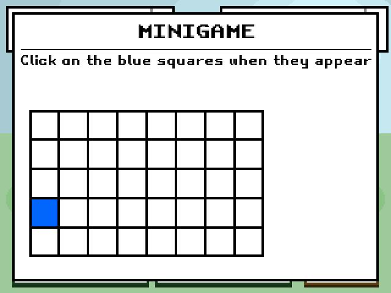

# **SmackTheDuck**

## Authors 

Olgierd Smyka, Magdalena Pabisz

## Overview
**SmackTheDuck** is a 2D RPG game developed using **Python** and **Pygame**. The game was awarded the distinction of **Best Group Project** in the *Programming in Python* course at **AGH** (academic year 2023/24). Players embark on an adventurous journey through a vast world, engaging in turn-based combat, exploring diverse locations, interacting with NPCs, and leveling up their character. The game features a unique combat system, where players select a companion animal and participate in exciting mini-games during battles. Each mini-game, when won, increases the damage of the player's next attack, and the mini-game type differs depending on the chosen companion animal.

## Most influential features
- ### **Vast World with Diverse Locations** :sunrise_over_mountains:

Explore different environments and uncover hidden secrets.
<p align="center">
  
  
  
  
</p>

- ### **Turn-Based Combat System** :smirk_cat:

Players take turns with their companion animal to engage in strategic battles.
<p align="center">
  
  
</p>

- ### **Interactive NPCs** :shipit:

Dialogue options allow players to interact with different NPCs.
<p align="center">
  
  
  
</p>

- ### **Mini-Games for Special Attacks** :boom:

Win mini-games to boost the damage of your next attack. The mini-game differs depending on the chosen companion animal.
<p align="center">
  
  
</p>

- ### **Leveling System**: :hatching_chick: :soon: :baby_chick:

Gain experience points through battles, improving your companion's statistics.
<p align="center">
  
</p>

- ### **Final Boss Battle** :facepunch:

Face a challenging boss to complete your journey.
<p align="center">
  
</p>

## Setup

### Windows
```bash
python -m venv env
.\env\Scripts\activate
pip install -r requirements.txt
```

### Linux
```bash
python3 -m venv env
source env/bin/activate
pip install -r requirements.txt
```

## Licence
This project is licensed under the MIT License - see the [LICENSE](LICENSE) file for details
